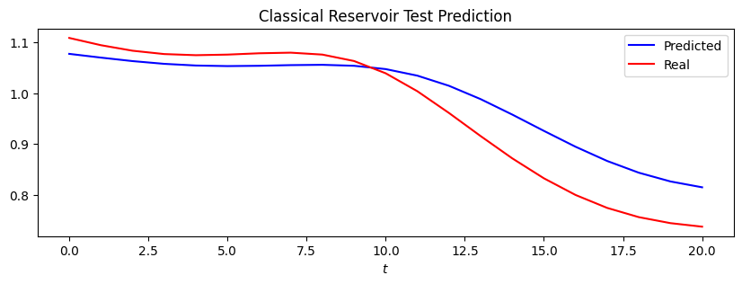

# NAREF

## Neutral Atom Renewable Energy Forecasting

This file showcases quantum and classical reservoirs in a simple example.


```python
import naref
```


```python
from naref.classical.hyper import HyperC
from naref.quantum.hyper import HyperQ
from naref.quantum import QRC
from naref.classical import CRC
from naref import data
```


```python
qrc = QRC(
    sample_len=8,
    nb_atoms=9,
    N_samples=1024,
    inp_duration=1000,
    reset_rate=0,
    geometry="grid_lattice_centred",
    atom_distance=15,
    input_type="mackey",
    test_len=data.real_test_len,
    train_len=data.real_train_len,
    verbose=True)

qrc.build_model(data.mackey[:250], data.mackey[250:280])
qrc.show_test_prediction()
qrc.show_train_prediction()

qrc.get_error_train()
qrc.get_error_test()
```

    Building Quantum Reservoir...
    10 training steps finished, training time : 24.890s
    20 training steps finished, training time : 24.411s
    30 training steps finished, training time : 24.441s
    40 training steps finished, training time : 25.471s
    50 training steps finished, training time : 25.757s
    60 training steps finished, training time : 25.194s
    70 training steps finished, training time : 24.324s
    80 training steps finished, training time : 24.378s
    90 training steps finished, training time : 31.824s
    100 training steps finished, training time : 29.980s
    110 training steps finished, training time : 28.739s
    120 training steps finished, training time : 27.935s
    130 training steps finished, training time : 30.140s
    140 training steps finished, training time : 31.482s
    150 training steps finished, training time : 33.550s
    160 training steps finished, training time : 33.109s
    170 training steps finished, training time : 31.198s
    180 training steps finished, training time : 32.346s
    190 training steps finished, training time : 34.320s
    200 training steps finished, training time : 37.271s
    210 training steps finished, training time : 37.513s
    220 training steps finished, training time : 33.800s
    230 training steps finished, training time : 35.306s
    240 training steps finished, training time : 34.594s
    Training finished. Total training time: 731.384s
    Train error (Mean absolute error regression loss):  5.165748453421183e-15
    10 testing steps finished, testing time : 36.515s
    20 testing steps finished, testing time : 34.390s
    Test error (Mean absolute error regression loss):  0.014927562760331666
    


    

    


    

    


    0.014927562760331666


```python
crc = CRC(
    sample_len=8,
    nb_neurons=9)
crc.build_model(data.mackey[:250], data.mackey[250:280])
crc.show_test_prediction()
crc.show_train_prediction()
crc.get_error_test()
```

    Building Classical Reservoir...
    


    

    


    

    


    0.047504000683266046


```python
crc.get_error_train()
```


    0.05308248069948858


```python
crc = CRC(
    sample_len=8,
    nb_neurons=15)
crc.build_model(data.mackey[:500], data.mackey[500:530])
crc.show_test_prediction()
crc.show_train_prediction()
crc.get_error_test()
```

    Building Classical Reservoir...
    


    

    


    

    


    0.009784391178625047


```python
crc.get_error_train()
```


    0.008250889994704327


```python

```
